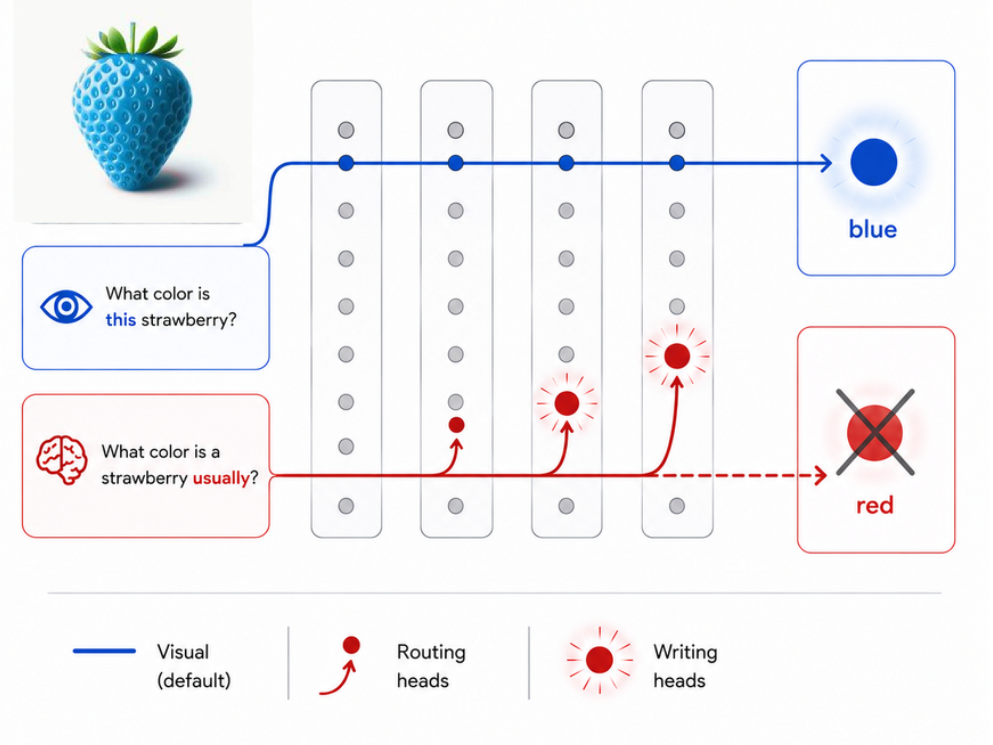

# Vision-Default, Prior-Override

<p align="center">
  
</p>

Code for the paper **"Vision-Default, Prior-Override: Causal Mechanisms of
Perception-Knowledge Conflict in Vision-Language Models."**

Vision-language models must reconcile what they see with what they know. Shown a
counterfactual image (a blue banana, a pink elephant), a model faces a conflict between the
visual evidence and the world-knowledge prior memorized during pretraining. This repository
contains the code for a causal, component-level analysis of how that conflict is resolved:
activation patching, knockout ablation, and mechanistic analysis (attention patterns and a
difference logit lens) across three VLM families (Qwen 2.5 VL, LLaVA-NeXT, PaliGemma 2) at
configurations from 3B to 10B parameters.

## Installation

Requires Python 3.12+ and [uv](https://docs.astral.sh/uv/).

```bash
uv sync
cp .env.example .env
# edit .env and set HF_TOKEN (required for gated models and the dataset)
```

Scripts are run with `PYTHONPATH=src:.` so that both the `vdpo` package (under `src/`) and the
repository's `scripts` package (the analysis and figure scripts import helpers from it) are
importable.

## Hardware

The experiment scripts (`scripts/run_*.py`) load a VLM and run forward passes under NNsight, so
they require a CUDA GPU. Models load in 4-bit by default (`LOAD_IN_4BIT=true`); set it to
`false` in `.env` for full precision if you have the VRAM. The analysis and figure scripts
(`scripts/analysis/`, `scripts/paper_figures/`) read the saved outputs and run on CPU.

## Dataset

Experiments use [`mgolov/Visual-Counterfact`](https://huggingface.co/datasets/mgolov/Visual-Counterfact)
from HuggingFace, accessed with your `HF_TOKEN`. Two examples (radish, spider) are excluded
automatically by the dataset loader because their original and counterfactual colors overlap,
leaving no genuine perception-knowledge conflict; no manual step is required.

## Tutorial

[`tutorial.ipynb`](tutorial.ipynb) is a short, self-contained walkthrough: it loads
Qwen2.5-VL 3B, takes one counterfactual example, and shows that ablating a small set
of promoting attention heads flips the model from the memorized color to the color
in the image, both in the next-token logits and in generated text. It needs a GPU and
`HF_TOKEN` but no precomputed outputs. The load cell auto-detects the device, so it also
runs on Apple Silicon (full precision on the MPS backend); the committed cell outputs were
produced on an M4. Start there before the full pipeline below.

## Model configurations

The paper covers five configurations. Each family only accepts the sizes it actually ships, so
not every `--model-size` is valid for every `--model-family`:

| `--model-family` | valid `--model-size` |
|------------------|----------------------|
| `qwen`           | `3B`, `7B`           |
| `llava_next`     | `7B` (the size argument is ignored; the family has a single checkpoint) |
| `paligemma_2`    | `3B`, `10B`          |

Other size values are accepted by the CLI but will fail to download for families that do not
publish them.

## Reproduction pipeline

Run the stages in order; each consumes the previous stages' outputs. The commands below use
`qwen 3B` as the example; repeat per configuration from the table above.

### 1. Experiments (GPU)

Write per-example results to `outputs/`:

```bash
PYTHONPATH=src:. python scripts/run_inference.py --model-size 3B --model-family qwen
PYTHONPATH=src:. python scripts/run_patching_last_token_res_stream.py --model-size 3B --model-family qwen
PYTHONPATH=src:. python scripts/run_patching_last_token_attn_heads.py --model-size 3B --model-family qwen
PYTHONPATH=src:. python scripts/run_patching_last_token_mlp.py --model-size 3B --model-family qwen
PYTHONPATH=src:. python scripts/run_extract_attention_weights.py --model-size 3B --model-family qwen
```

The patching and knockout-ablation runners also accept `--contrast {prior_circuit,visual_circuit}`
(default `prior_circuit`). The visual-circuit appendix figure additionally needs the
residual-stream patching run under that contrast:

```bash
PYTHONPATH=src:. python scripts/run_patching_last_token_res_stream.py --model-size 3B --model-family qwen --contrast visual_circuit
```

### 2. Analysis and classification (CPU)

Read `outputs/` and write summary JSON to `data/`:

```bash
PYTHONPATH=src:. python scripts/analysis/classify_attn_heads.py
PYTHONPATH=src:. python scripts/analysis/classify_mlp_layers.py
PYTHONPATH=src:. python scripts/analysis/difference_logit_lens.py
```

These produce `data/classify_attn_heads.json`, `data/classify_mlp_layers.json`, and
`data/difference_logit_lens.json`. The knockout-ablation runners read their targets from the two
classification files, so this step must run before step 3. `scripts/analysis/` also contains
reporting scripts (`inference.py`, `patching_last_token.py`, `attention_patterns.py`,
`knockout_attn_heads.py`, `knockout_mlp.py`) that print the tables reported in the paper.

### 3. Knockout ablation (GPU)

Uses the classifications from step 2:

```bash
PYTHONPATH=src:. python scripts/run_knockout_attn_heads.py --model-size 3B --model-family qwen
PYTHONPATH=src:. python scripts/run_knockout_mlp.py --model-size 3B --model-family qwen
```

### 4. Figures (CPU)

Each figure script writes a PDF to `figures/` and runs once the stages it depends on have
completed for all five configurations:

```bash
PYTHONPATH=src:. python scripts/paper_figures/fig1_res_stream.py
```

| Figure script | Depends on |
|---------------|------------|
| `fig1_res_stream.py`                   | step 1 residual-stream patching |
| `fig2_head_classification.py`          | step 1 attention-head patching |
| `fig3_knockout.py`                     | step 3 attention-head knockout ablation |
| `fig4_attention_routing.py`            | step 1 attention extraction + `data/classify_attn_heads.json` |
| `fig_app_res_stream_all.py`            | step 1 residual-stream patching |
| `fig_app_res_stream_visual_circuit.py` | step 1 residual-stream patching with `--contrast visual_circuit` |
| `fig_app_mlp_restoration.py`           | step 1 MLP patching |
| `fig_app_head_classification_all.py`   | step 1 attention-head patching |
| `fig_app_attention_routing.py`         | step 1 attention extraction + `data/classify_attn_heads.json` |
| `fig_app_logit_lens.py`                | `data/difference_logit_lens.json` (step 2) |

## Repository structure

```
src/vdpo/        Core library: VLM adapters, experiment runners, types, utilities
scripts/         run_*.py (experiments), analysis/ (classification), paper_figures/ (plots)
data/            Classification JSON written by scripts/analysis/ (generated; read by the knockout ablation runners)
tests/           Unit tests for contrast and patching helpers
```

Run the tests with:

```bash
PYTHONPATH=src:. uv run pytest
```

## License

MIT. See [LICENSE](LICENSE).

## Citation

The paper is not yet published. A BibTeX entry will be added here on publication.
